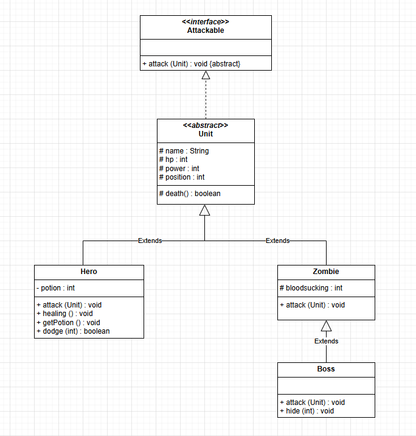

# Zombie Game
* 자바로 다형성 콘솔 게임을 구현하였습니다

>#### 게임 설명
- 플레이어는 영웅이 되어 몰려오는 좀비들을 처치하는 게임이다.
- 5턴마다 좀비가 등장하고 마지막엔 보스가 생성된다.
- 플레이어는 5개의 물약을 가지고 시작하고 HP가 70%가 되면 자동으로 물약을 먹어 회복한다.
- 플레이어의 패시브 스킬과 좀비들의 스킬들을 자동사냥으로 구현해보았다.
- 보스 좀비를 물리치고 뺏긴 백신을 확보하여 좀비 바이러스를 치료한다.

>#### Class Diagram

>#### Demo

